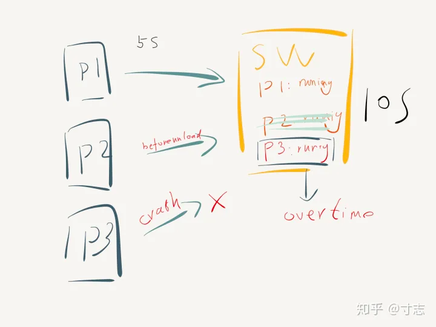

## 监听浏览器、浏览器标签页关闭

监听浏览器、浏览器标签页关闭的使用场景：

- 用户关闭浏览器时，自动保存填写/修改的数据，将数据发送给服务端

浏览器加载、刷新、卸载（关闭）时触发的事件：

- 加载时：触发 `onload` 事件
- 刷新时：先触发 `onbeforeunload` 事件，然后是 `onunload` 事件，最后是 `onload` 事件
- 卸载时：先触发 `onbeforeunload` 事件，然后是 `onunload` 事件

刷新和卸载页面时都会先后触发 `onbeforeunload` 和 `onunload` 事件，但刷新页面的时候时不需要调用接口的，那么就需要区分刷新和关闭行为。

根据时间差来实现判断是刷新还是关闭标签：在点击刷新或者关闭时开始计时记录下这一刻的时间戳，因为刷新和关闭 在执行 `onunload` 方法时的时间不一样，一般情况下经过测试：

关闭时时间差不大于 3 毫秒，刷新时即使只有一个简单的页面都不少于 10 毫秒，而一般网站网页内容更多，时间差达到了 100 多毫秒

根据上面的分析，我们尝试封装用于监听浏览器关闭的 `BrowserEvent` 代码，如下所示

```js
class BrowserEvent {
  constructor(options) {
    const { url, type } = options;
    this.url = url;
    this.type = type;
    this.listeners = [];

    window.addEventListener("beforeunload", this._onBeforeunload.bind(this), false);
    window.addEventListener("unload", this._onUnload.bind(this), false);
  }

  sub(type, handler, always) {
    if (!this.listeners[type]) {
      this.listeners[type] = [];
    }
    this.listeners[type].push({ handler, always });
  }

  on(type, handler, always = true) {
    this.sub(type, handler, always);
  }

  emit(type, evt) {
    if (this.listeners[type]) {
      this.listeners[type].forEach((listener) => {
        listener.handler(evt);
      });

      this.listeners[type] = this.listeners[type].slice().filter((listener) => Boolean(listener.always));
    }
  }

  _onBeforeunload() {
    this.beginTime = new Date().getTime();
  }

  _onUnload() {
    const differTime = new Date().getTime() - this.beginTime;

    if (differTime < 5) {
      this.emit("BROWSER_CLOSE_TOO_QUICK");
    }
  }

  send(data) {
    this.on(
      "BROWSER_CLOSE_TOO_QUICK",
      function () {
        this._send(this.url, data);
      }.bind(this)
    );
  }

  _sendBeaconByJson(url, data = {}) {
    const blob = new Blob([JSON.stringify(data)], {
      type: "application/json; charset=UTF-8",
    });
    return navigator.sendBeacon(url, blob);
  }

  _sendBeaconByFormData(url, data = {}) {
    const formData = new FormData();

    Object.entries(data).forEach((field) => {
      formData.append(field[0], field[1].toString());
    });

    navigator.sendBeacon(url, formData);
  }

  get _send() {
    const type = {
      json: this._sendBeaconByJson,
      formdata: this._sendBeaconByFormData,
    };

    return type[this.type];
  }
}

const browserEvent = new BrowserEvent({
  url: "url",
  type: "formdata",
});

browserEvent.send({ name: "qinghuanI" });
```

对 `BrowserEvent` 进行实例化，传入 `url` 和 `post` 接口的传参类型

## 监听浏览器标签页崩溃

这部分主要使用 Service Worker 实现浏览器标签页崩溃或关闭的监听

1. Service Worker 有自己独立的工作线程，与网页区分开，网页崩溃了，Service Worker 一般情况下不会崩溃；
2. Service Worker 生命周期一般要比网页还要长，可以用来监控网页的状态；
3. 网页可以通过 navigator.serviceWorker.controller.postMessage API 向掌管自己的 SW 发送消息。

基于以上几点，我们可以实现一种基于心跳检测的监控方案:



- p1：网页加载后，通过 postMessage API 每 5s 给 sw 发送一个心跳，表示自己的在线，sw 将在线的网页登记下来，更新登记时间；
- p2：网页在 beforeunload 时，通过 postMessage API 告知自己已经正常关闭，sw 将登记的网页清除；
- p3：如果网页在运行的过程中 crash 了，sw 中的 running 状态将不会被清除，更新时间停留在奔溃前的最后一次心跳；
- sw：Service Worker 每 10s 查看一遍登记中的网页，发现登记时间已经超出了一定时间（比如 15s）即可判定该网页 crash 了。

```js
// main.js

if (navigator.serviceWorker.controller !== null) {
  let HEARTBEAT_INTERVAL = 5 * 1000; // 每五秒发一次心跳
  let sessionId = uuid();
  let heartbeat = function () {
    navigator.serviceWorker.controller.postMessage({
      type: "heartbeat",
      id: sessionId,
      data: {}, // 附加信息，如果页面 crash，上报的附加数据
    });
  };
  window.addEventListener("beforeunload", function () {
    navigator.serviceWorker.controller.postMessage({
      type: "unload",
      id: sessionId,
    });
  });
  setInterval(heartbeat, HEARTBEAT_INTERVAL);
  heartbeat();
}
```

sessionId 本次页面会话的唯一 id

postMessage 附带一些信息，用于上报 crash 需要的数据，比如当前页面的地址等等。

```js
// sw.js

const CHECK_CRASH_INTERVAL = 10 * 1000; // 每 10s 检查一次
const CRASH_THRESHOLD = 15 * 1000; // 15s 超过15s没有心跳则认为已经 crash
const pages = {};
let timer;
function checkCrash() {
  const now = Date.now();
  for (var id in pages) {
    let page = pages[id];
    if (now - page.t > CRASH_THRESHOLD) {
      // 上报 crash
      delete pages[id];
    }
  }
  if (Object.keys(pages).length == 0) {
    clearInterval(timer);
    timer = null;
  }
}

worker.addEventListener("message", (e) => {
  const data = e.data;
  if (data.type === "heartbeat") {
    pages[data.id] = {
      t: Date.now(),
    };
    if (!timer) {
      timer = setInterval(function () {
        checkCrash();
      }, CHECK_CRASH_INTERVAL);
    }
  } else if (data.type === "unload") {
    delete pages[data.id];
  }
});
```

## 监听浏览器标签页切换

监听浏览器标签页切换的使用场景：

- 客户端轮询
- 网页动画
- 正在播放对音频或视频

Document.visibilityState （只读属性）, 返回 document 的可见性，即当前可见元素的上下文环境。由此可以知道当前文档 (即为页面) 是在背后，或是不可见的隐藏的标签页，或者 (正在) 预渲染。可用的值如下：

- `visible` : 此时页面内容至少是部分可见。即此页面在前景标签页中，并且窗口没有最小化
- `hidden` : 此时页面对用户不可见。即文档处于背景标签页或者窗口处于最小化状态，或者操作系统正处于**锁屏状态**
- `prerender` : 页面此时正在渲染中，因此是不可见的。文档只能从此状态开始，永远不能从其他值变为此状态。注意：浏览器支持是可选的
  当此属性的值改变时，会递交 `visibilitychange` 事件给 Document

如下代码示例

```js
document.addEventListener("visibilitychange", function (event) {
  if (document.hidden) {
    document.title = "离开了";
  } else {
    document.title = "我来了";
  }
});
```
